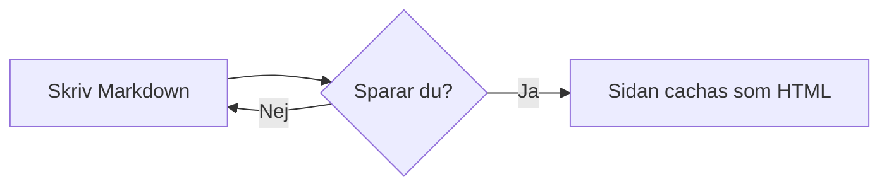

# Syntax-guide

En snabb genomgång av allt du kan skriva i en wikisida. Fullständig
dokumentation finns i `README.md` i projektroten.

## Wikilänkar

`[[namespace:sida]]` länkar internt. Sidor som inte finns än visas som en
röd, streckad länk — klicka för att skapa dem direkt:

[[hjalp:en-sida-som-inte-finns-an]]

Namespace-syntaxen `namespace:page1:start` mappas till filen
`content/namespace/page1.start.md` — första kolondelen blir mappen, resten
slås ihop med `.` till filnamnet.

Egen länktext: `[[namespace:sida|Egen text]]`. Snedstreck fungerar också:
`[[namespace/sida]]` normaliseras automatiskt till kolon.

## Markdown-länkar

`[text](/namespace/sida)` och `[text](namespace:sida)` fungerar som interna
länkar (samma röda-länk-koll som ovan). `[text](https://...)` blir en
extern länk.

## Interwiki-länkar

Genvägar konfigurerade i `config/interwiki.php`:

* [[wp>Wikipedia]] — Wikipedia
* [[php>function.array-map]] — PHP-manualen

## Media

Ladda upp en fil på [/media](/media) och bädda in den i en sida:

```
{{namespace:bild.png}}
{{namespace:bild.png|Alt-text}}
{{namespace:dokument.pdf|Ladda ner}}
```

Bilder (`png`, `jpg`, `gif`, `svg`, `webp` m.fl.) visas inbäddade —
övriga filtyper blir en nedladdningslänk.

## Taggar

Sätt `tags: [en, två]` i frontmatten så blir de klickbara badges som söker
fram alla sidor med samma tagg (`tag:nyckelord`).

## Standard-Markdown

**Fet text**, *kursiv text*, `inline-kod`, kodblock med språkmarkering,
punktlistor, numrerade listor och citat:

```php
echo "kodblock med syntax-markering";
```

- Punktlista
- Ännu en punkt

1. Numrerad lista
2. Andra punkten

> Ett citat.

## Mermaid-diagram

Ett kodblock märkt `mermaid` renderas som ett riktigt diagram, både på
wikisidor och i AI-chatten:


