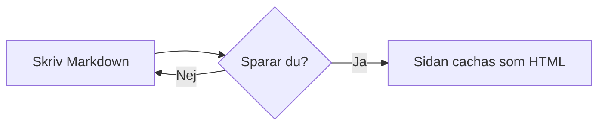

# Syntax-guide

En snabb genomgång av allt du kan skriva i en wikisida. Fullständig
dokumentation finns i `README.md` i projektroten.

## Wikilänkar

`[[namespace:sida]]` länkar internt. Sidor som inte finns än visas som en
röd, streckad länk — klicka för att skapa dem direkt:

[[hjalp:en-sida-som-inte-finns-an]]

Namespace-syntaxen `namespace:page1:start` mappas till filen
`content/namespace/page1.start.md` — första kolondelen blir mappen, resten
slås ihop med `.` till filnamnet.

Egen länktext: `[[namespace:sida|Egen text]]`. Snedstreck fungerar också:
`[[namespace/sida]]` normaliseras automatiskt till kolon.

Sidans första `# Rubrik` används som titel i interna länkar, sökning och
chattens sidlistor. Saknas H1 används `title:` i frontmatter, därefter
filnamnet. Rubriker inuti kodblock räknas inte.
`[[demo:demo]]` visar alltså **Demo av detta** om målsidan börjar med
`# Demo av detta`. Egen länktext efter `|` behålls alltid.
Editorns `[[`-förslag söker på både sid-ID och titel och infogar
`[[demo:demo|Demo av detta]]`. Den infogade texten är fast; använd
`[[demo:demo]]` om länktexten ska följa framtida rubrikändringar.

## Markdown-länkar

`[text](/namespace/sida)` och `[text](namespace:sida)` fungerar som interna
länkar (samma röda-länk-koll som ovan). `[text](https://...)` blir en
extern länk.

## Interwiki-länkar

Genvägar konfigurerade i `config/interwiki.php`:

* [[wp>Wikipedia]] — Wikipedia
* [[php>function.array-map]] — PHP-manualen

## Media

SVG-bilder infogas som vanliga bilder, exempelvis
`` eller `{{oversikt.svg|Översikt}}`.
Klicka på bilden för zoom och panorering. Dra för att flytta bilden,
använd mushjulet eller +/− för zoom och **Anpassa** för att återställa.
Tangentbord: Enter öppnar, pilar panorerar, 0 anpassar och Escape stänger.

## Inbäddade sidor (iframe)

Skriv på en egen rad, eller välj **iframe inbäddad sida** via Ctrl+Space:

```text
{{iframe:https://example.com|Exempelsida|600}}
```

Sista värdet är höjden i pixlar (200–1600, standard 600); bredden följer
sidan. Titel och höjd kan utelämnas. Under ramen finns alltid en länk som
öppnar sidan i en ny flik. Även interna adresser som `/hjalp/syntax` stöds.
Webbplatsen som bäddas in kan förbjuda iframe-visning; använd då länken
under ramen. Ramen är isolerad, vilket kan begränsa inloggning och vissa
interaktiva funktioner på den inbäddade sidan.

## Ladda upp och bädda in media

Ladda upp en fil på [/images](/images) och bädda in den i en sida:

```
{{namespace:bild.png}}
{{namespace:bild.png|Alt-text}}
{{namespace:dokument.pdf|Ladda ner}}
```

Bilder (`png`, `jpg`, `gif`, `svg`, `webp` m.fl.) visas inbäddade —
övriga filtyper blir en nedladdningslänk.

Du kan också kopiera en bild eller skärmbild och trycka **Ctrl+V** direkt
i editorn. Bilden laddas upp till `images/` (i sidans namespace om det finns)
och infogas som ``.
Byt beskrivningen till en passande alt-text. Spara-knapparna blir tillgängliga
när uppladdningen är klar. Vanlig text klistras in som vanligt.

## Taggar

Sätt `tags: [en, två]` i frontmatten så blir de klickbara badges som söker
fram alla sidor med samma tagg (`tag:nyckelord`).

## Standard-Markdown

I editorn fortsätter **Enter** automatiskt punktlistor (`-`, `*`, `+`) och
checkboxar (`- [ ]`) på nästa rad, med samma indrag. En bockad checkbox
(`- [x]`) ger en ny tom checkbox. Tryck **Enter** på en tom listpunkt för
att avsluta listan. **Shift+Enter** ger en vanlig radbrytning.

**Fet text**, *kursiv text*, `inline-kod`, kodblock med språkmarkering,
punktlistor, numrerade listor och citat:

```php
echo "kodblock med syntax-markering";
```

- Punktlista
- Ännu en punkt

1. Numrerad lista
2. Andra punkten

> Ett citat.

### Tabeller

Använd kolon i avdelarraden för vänster-, höger- eller mittjustering:

| Område | Klart | Status |
| :--- | ---: | :---: |
| **Dokumentation** | 80 % | Pågår |
| Bilder | 100 % | Klar |

På små skärmar kan breda tabeller rullas i sidled. Skriv `\|` för ett
lodrätt streck i en cell. Wikilänkar och inline-kod fungerar också i tabeller.

### Checklistor och underlistor

- [x] Färdig uppgift
- [ ] Återstående uppgift
  - En underpunkt
  - Ytterligare en underpunkt

Ändra `[ ]` till `[x]` i editorn för att markera en uppgift som klar.
Du kan även skriva ~~överstruken text~~ och använda `_kursiv_` eller
`__fet__` text. Vanliga Markdown-bilder stöds: ``.

## Informationsboxar

Skriv `::: typ` följt av innehåll och avsluta med `:::` på en egen rad.
En egen rubrik kan skrivas efter typen. Boxen stödjer samma Markdown som
resten av sidan: listor, tabeller, länkar, bilder, kodblock och Mermaid.
Tryck **Ctrl+Space** och skriv **box** i editorn för färdiga mallar.

````markdown
::: info Bra att veta
Här finns **viktig information** och en [[start|länk till startsidan]].

- Första punkten
- Andra punkten
:::

::: warning Innan du fortsätter
Säkerhetskopiera först.
:::
````

::: info Bra att veta
Boxar kan innehålla **Markdown**, listor och [[start|wikilänkar]].
:::

::: tip Tips
Använd en kort rubrik som förklarar innehållet.
:::

::: warning Innan du fortsätter
Läs instruktionerna innan du ändrar något.
:::

| Typ | Utseende / användning |
| --- | --- |
| `simple` | Neutral grå box, ingen standardrubrik |
| `info` | Blå information |
| `note` | Blågrå notering |
| `tip` | Gul ton för tips |
| `important`, `warning` | Orange, viktigt eller varning |
| `danger`, `caution` | Röd varning |
| `help` | Lila hjälp |
| `download`, `success` | Grön nedladdning eller klart |
| `todo` | Turkos att göra |

GitHub-stil fungerar också:

```markdown
> [!NOTE]
> En notering med **Markdown**.
>
> - En punkt
```

I GitHub-stil måste varje rad i boxen börja med `>`. För längre innehåll
är `:::`-formen enklare. Boxar kan ligga inuti andra boxar; varje box
behöver en egen avslutande `:::`. Färgerna anpassas till ljust och mörkt läge.

## Mermaid-diagram

Ett kodblock märkt `mermaid` renderas som ett riktigt diagram, både på
wikisidor och i AI-chatten:



På wikisidor kan du klicka på diagrammet (eller fokusera det och trycka Enter) för
att öppna diagramvisaren. Zooma med mushjulet eller knapparna **+ / −**,
och dra diagrammet för att panorera. **Anpassa** visar hela diagrammet.
Med tangentbordet fungerar piltangenterna, **+ / −**, **0** för att anpassa
och **Esc** för att stänga.
